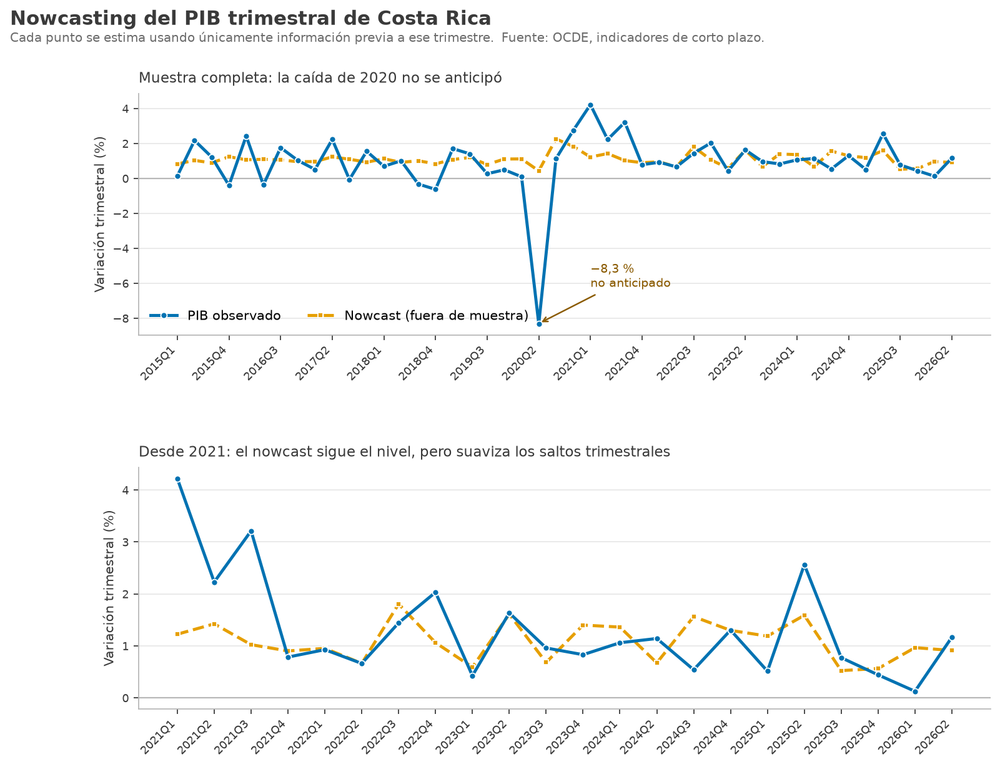

# Nowcasting del PIB trimestral de Costa Rica

**¿Se puede estimar el crecimiento del PIB antes de que se publique la cifra oficial?**

> Sí, pero mucho menos de lo que sugiere una lectura descuidada. Frente a repetir el
> trimestre anterior, el nowcast reduce el error **30,6 %**. Frente al referente
> exigente —predecir el promedio histórico— la mejora real es de **6,5 %**.
> Toda la señal proviene de **una sola variable**: la producción manufacturera
> (t = 3,53). Las exportaciones no resultan significativas (t = 1,35).



---

## Por qué importa

El PIB trimestral se publica con meses de rezago. Un banco central, un ministerio de
hacienda o un inversionista necesitan una lectura del trimestre **en curso**, no
dentro de tres meses. Los indicadores de coyuntura —producción industrial, comercio
exterior— salen mucho antes. La pregunta práctica es cuánto anticipan realmente.

## Datos

Indicadores de corto plazo de la **OCDE** para Costa Rica (miembro desde 2021), vía
su API SDMX pública. Son las cifras que el propio BCCR reporta a la organización.

- 14.220 observaciones, 2000 → 2026
- PIB trimestral en volumen hasta **2026-Q2**; indicadores mensuales hasta **2026-08**
- Descarga reproducible: `python descargar_datos.py` (sin llave de acceso)

## Tres decisiones metodológicas que cambian el resultado

**1. Se nowcastea la variación trimestral, no la interanual.**
La interanual es tan persistente que repetir el dato previo ya es una predicción
fuerte. En esa versión el modelo mejoraba **+13,7 %** sobre el ingenuo — pero al
excluir 2020 la mejora caía a **+0,6 %**: todo el mérito era la pandemia. Cambiar
el objetivo a la variación trimestral vuelve el ejercicio informativo y la mejora
consistente (+30,6 % completa, +31,8 % excluyendo 2020).

**2. Dos referentes, no uno.**
Superar "repetir el trimestre anterior" es fácil, porque la serie trimestral revierte
a la media. El referente honesto es el **promedio histórico**, y contra él la mejora
es de 6,5 %. Reportar solo el primero habría inflado el resultado casi cinco veces.

**3. Menos predictores ganan.**
Con seis regresores el modelo sobreajustaba: fuera de muestra rendía peor que con
dos. Se probaron 36 especificaciones (objetivo × predictores × ventana × regularización)
y las parsimoniosas dominaron de forma sistemática.

## Resultados fuera de muestra

Ventana expansiva: para el trimestre *t* el modelo se ajusta solo con datos hasta
*t−1*. Nunca ve el futuro.

| Referente | RMSE | MAE | Mejora del nowcast |
|---|---|---|---|
| **Nowcast** | **1,59** | **0,89** | — |
| Repetir el trimestre previo | 2,29 | 1,46 | +30,6 % |
| Promedio histórico | 1,70 | 0,95 | +6,5 % |

Excluyendo 2020: +31,8 % y +7,0 % respectivamente. El resultado no depende de la pandemia.

## Limitaciones — lo que el modelo no hace

- **No anticipa puntos de quiebre.** En 2020-Q2 el PIB cayó 8,3 % y el nowcast
  predijo +0,4 %. Un modelo lineal sobre indicadores de producción no ve venir un
  cierre administrativo de la economía.
- **Suaviza la amplitud.** El panel inferior del gráfico lo muestra: el nowcast
  sigue el nivel pero comprime los saltos. Gran parte de su ventaja viene de ser
  conservador, no de acertar giros.
- **R² dentro de muestra = 0,154.** Es un modelo de señal débil. Se reporta porque
  esconderlo sería el error que este proyecto justamente critica.
- **Sin datos de vintage.** Se usan las series revisadas actuales, no las que
  realmente estaban disponibles en cada fecha. Un ejercicio en tiempo real estricto
  necesitaría el archivo de revisiones.

## Reproducir

```bash
pip install pandas numpy matplotlib requests
python descargar_datos.py    # baja los datos de la OCDE
python nowcast.py            # modelo, evaluación y gráfico
```

## Archivos

| Archivo | Contenido |
|---|---|
| `descargar_datos.py` | Descarga reproducible desde la API SDMX de la OCDE |
| `nowcast.py` | Panel, backtest, diagnóstico de regresión y gráfico |
| `resultados_nowcast.csv` | Nowcast y referentes, trimestre por trimestre |
