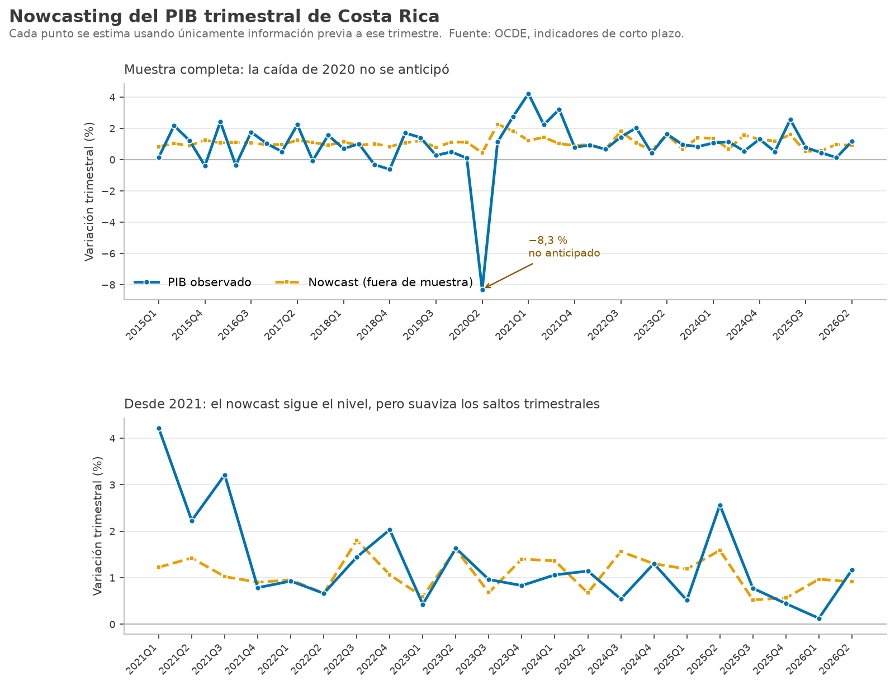
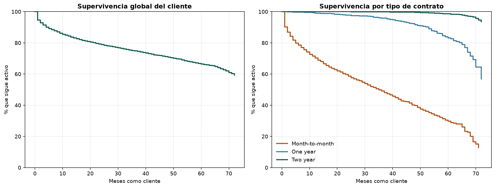

# Portafolio de análisis de datos — José Pablo Guerrero

Economista (Universidad Latina de Costa Rica), con formación en econometría y series
de tiempo. Análisis construidos sobre datos públicos, priorizando preguntas de negocio
sobre demostraciones de herramientas.

`Python` · `pandas` · `numpy` · `matplotlib` · `SQL` · `Excel / Power Query`

---

## Nowcasting del PIB trimestral de Costa Rica

**¿Se puede estimar el crecimiento del PIB antes de que se publique la cifra oficial?**

> Frente a repetir el trimestre anterior, el nowcast reduce el error **30,6 %**.
> Frente al referente exigente —predecir el promedio histórico— la mejora real es
> **6,5 %**. Toda la señal proviene de una sola variable: la producción manufacturera
> (t = 3,53); las exportaciones no resultan significativas.

Nowcastear la variación *interanual* daba +13,7 % de mejora, pero al excluir 2020 caía
a +0,6 %: todo el mérito era la pandemia. Cambiar el objetivo a la variación *trimestral*
y evaluar contra **dos** referentes en lugar de uno vuelve el resultado consistente. Se
probaron 36 especificaciones; las parsimoniosas superaron sistemáticamente a las de seis
predictores.

El modelo no anticipa quiebres: en 2020-Q2 el PIB cayó 8,3 % y el nowcast predijo +0,4 %.
Está declarado, junto con el R² de 0,154.

**[Ver proyecto →](nowcasting-pib/)**

---

## Churn y valor de vida del cliente

**¿Cuánto dura un cliente y cuánto vale retenerlo?**

> El contrato mes a mes presenta **42,7 % de cancelación** frente a **2,8 %** del
> contrato a dos años. Un cliente a dos años vale **$1.964 más** en valor de vida,
> con una cuota mensual casi idéntica. El segmento mes a mes concentra alrededor de
> **$1,3 M** de ingreso anual en riesgo.

El conjunto de datos es transversal y no tiene fechas de alta, así que no admite una
matriz de cohortes. El método correcto es Kaplan-Meier, tratando a los clientes activos
como censurados por la derecha. El estimador está implementado a mano y **validado
contra `lifelines`** (diferencia máxima 4,33e-15).

Ignorar la censura habría subestimado la permanencia en 40 % (32,4 frente a 54,3 meses),
y con ella toda la justificación económica de invertir en retención.

**[Ver proyecto →](churn-supervivencia/)**

---

## Buscador automático de vacantes

Consulta APIs públicas de portales de empleo, filtra por perfil analítico y mantiene un
registro de seguimiento que nunca sobrescribe ediciones manuales.

Incorpora dos criterios que los portales publican pero rara vez se explotan: si la
vacante admite candidatos residentes en Costa Rica, y cuántas personas ya aplicaron.
El README documenta el comportamiento real de cada API —incluidas las que fallan en
silencio— y por qué el script deliberadamente no envía aplicaciones automáticas.

**[Ver proyecto →](buscador-vacantes/)**

---

## Criterios que sigo

- **El hallazgo va primero**, con número, en las primeras líneas.
- **Las limitaciones se declaran.** Un resultado que no sobrevive al escrutinio es
  un hallazgo, no un fracaso que esconder.
- **Datos públicos únicamente**, con descarga reproducible desde el propio script.
- **Los datos crudos no se versionan** — el código los obtiene solo.

---

📍 Costa Rica · Español nativo, inglés C1 · [LinkedIn](https://linkedin.com/in/jpguerreroc)
