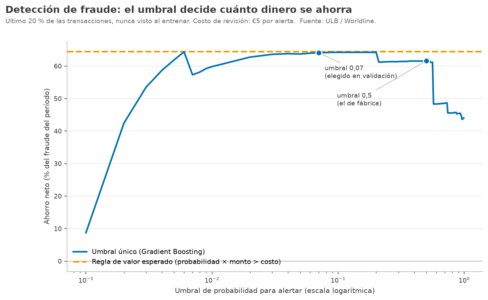

# Detección de fraude con tarjeta: cuánto dinero ahorra cada regla de alerta

*[English version](README.en.md)*

**No alertar nunca acierta el 99,87 % de las veces y no ahorra un euro.**

Un banco no decide "¿es fraude?". Decide "¿mando esta transacción a revisión?", y
cada revisión cuesta. Este proyecto mide los modelos en dinero ahorrado, no en
exactitud, sobre 284.807 transacciones reales con 0,17 % de fraude.

| Costo por revisión | Mejor umbral único | Regla de valor esperado | Diferencia (IC 95 %) |
|---|---:|---:|---:|
| €1 | 67,9 % | 74,0 % | −€179 a +€2.349 |
| €5 | 64,1 % | 64,4 % | −€52 a +€104 |
| **€15** | **54,5 %** | **62,0 %** | **+€379 a +€782** |

*Ahorro neto como porcentaje del fraude del período de prueba, con Gradient
Boosting.*

Cuando revisar es caro, alertar por **probabilidad × monto > costo** ahorra 7,5
puntos más que el mejor umbral, y la diferencia es significativa. Lo hace
detectando **menos** fraudes (21 contra 57): deja pasar los de €1 y persigue los
que valen la revisión. Cuando revisar es barato, la diferencia no es significativa.



## El umbral de fábrica es caro

`predict()` alerta con probabilidad mayor a 0,5. Con la regresión logística eso
ahorra el **30,3 %** del fraude; el umbral elegido en validación (0,09) ahorra el
**55,5 %**. El mismo modelo, casi el doble de dinero, solo por mover un número que
casi nadie toca. Gradient Boosting es menos sensible (61,6 % contra 64,1 %), pero
la curva muestra el precipicio: un poco por encima de 0,5 el ahorro cae a 48 %.

## Decisiones metodológicas

1. **Partición temporal, no aleatoria.** Entrenamiento con el primer 60 % de las
   transacciones, elección del modelo y del umbral con el 20 % siguiente y
   evaluación con el último 20 %. En producción el modelo solo conoce el pasado.
2. **El modelo se elige en validación.** Gradient Boosting gana por PR-AUC (0,75
   contra 0,62) antes de mirar la prueba.
3. **Probabilidades sin reponderar.** La regla de valor esperado necesita que una
   probabilidad de 0,1 signifique 10 %. Los pesos de clase la inflan, así que no
   se usan. Calibración en prueba: 69,8 fraudes esperados contra 75 observados.
4. **Sensibilidad al costo de revisión.** No hay un número público, así que se
   reporta con tres valores en lugar de esconder el supuesto.
5. **Intervalos por bootstrap.** 2.000 remuestreos de las transacciones de prueba
   para la diferencia entre reglas. Con 75 fraudes, sin intervalo el número no
   significa nada.

## Limitaciones — lo que el proyecto no hace

- **La prueba tiene 75 fraudes y €7.729.** Es poco: por eso los intervalos, y por
  eso a €1 y €5 no se declara ganador.
- **Supone que una alerta revisada detiene el fraude completo.** En la práctica
  parte se recupera por contracargo y parte se pierde igual.
- **Dos días de datos de 2013.** No mide la deriva del fraude en meses, que es el
  problema real de un sistema en producción.
- **Las variables son componentes principales anónimos.** No se puede explicar
  qué patrón delata el fraude, solo cuánto vale detectarlo.

## Correr

```bash
pip install -r requirements.txt
python deteccion-fraude/fraude.py
```

Los datos (150 MB) se bajan solos la primera vez. No se versionan.

## Datos

Transacciones de tarjetas europeas de septiembre de 2013, publicadas por el
Machine Learning Group de la ULB y Worldline (Dal Pozzolo et al., 2015). Las
variables V1–V28 son componentes principales; `Amount` está en euros. Se baja de
la copia pública que usa TensorFlow, sin cuenta de Kaggle.

## Archivos

| Archivo | Contenido |
|---|---|
| `fraude.py` | Partición temporal, modelos, reglas de alerta, bootstrap y gráfico |
| `resultados_fraude.csv` | Alertas, fraudes detectados, exactitud y ahorro por modelo, costo y regla |
| `calidad_modelos.csv` | PR-AUC, Brier y calibración de cada modelo |
