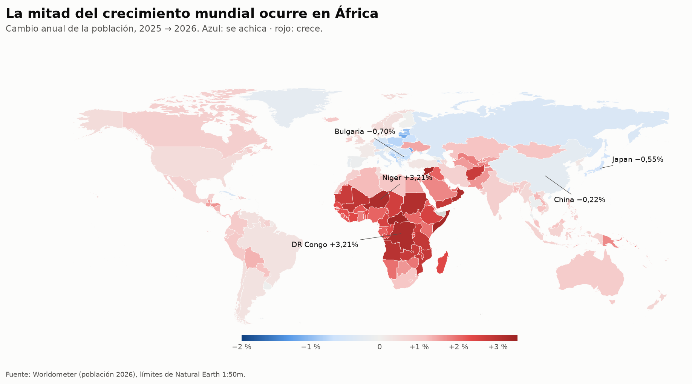
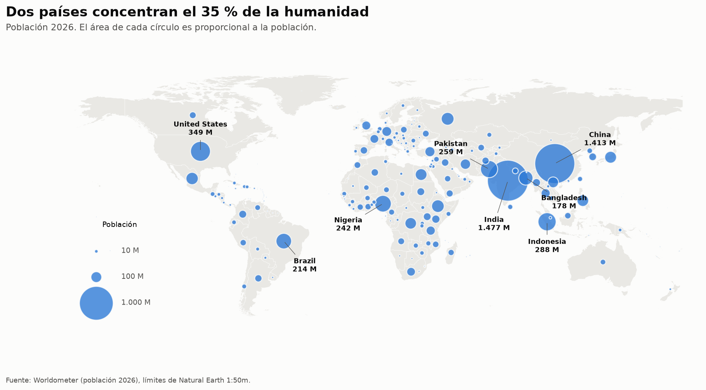

# Población mundial 2026: mapa en Power BI

*[English version](README.en.md)*

**[Explorar el atlas interactivo →](https://pabloguerrerocr.github.io/atlas/)**

[](https://github.com/pabloguerrerocr/portfolio-data-analytics/actions/workflows/datos-economicos.yml)

**África tiene el 19 % de la población mundial y aporta el 51 % de su crecimiento.**

Mientras tanto, 62 países se achican: entre ellos viven el 27 % de las personas
del planeta. Y el 73 % de la humanidad vive en un país con fecundidad por debajo
del reemplazo (2,1 hijos por mujer).

| | 2026 |
|---|---:|
| Población mundial | **8.299 M** |
| Crecimiento neto en el año | **+69,1 M (+0,84 %)** |
| Aporte de África al crecimiento | **50,8 %** |
| Países que pierden población | **62** (27 % de la población mundial) |
| Mayor caída absoluta | China, **−3,18 M** |
| Mayor aumento absoluto | India, **+12,76 M** |





Estas dos imágenes son la vista previa en Python. El entregable es el reporte de
Power BI que se arma con la guía de abajo: los mismos mapas, pero con filtros por
continente, tooltips por país y tarjetas que se recalculan con la selección.

## Atlas interactivo

[`web/index.html`](web/index.html) es una página que se abre en cualquier navegador,
sin servidor ni Power BI. Tiene el mapa con 18 indicadores de población y economía, filtros por continente y nivel de ingreso,
la ficha de cada país, un simulador que proyecta la población con la tasa actual y la
tabla completa ordenable. Se regenera con `python web/construir.py`.

## Datos económicos que se actualizan solos

`datos_economicos.py` baja del **Banco Mundial** (último año publicado por país) y del
**FMI** (estimaciones y proyecciones 2026) el PIB per cápita, el crecimiento, la
inflación, la deuda, la esperanza de vida, las remesas, el desempleo juvenil, la
dependencia y el Gini. Cada valor viaja con su año, y las cifras del FMI de más de dos
años se descartan, para que nada viejo pase por actual. Un flujo de GitHub Actions lo
corre el día 5 de cada mes y guarda `datos/economia.csv` si algo cambió.

Lo que agrega al análisis:

- Los países de ingreso bajo y medio-bajo tienen el **45 %** de la población y aportan el
  **85 %** de su crecimiento. Los de ingreso alto, el 17 % y el 3 %.
- En **20 países** (488 M de personas) la población crece más rápido que la economía en
  2026: el ingreso por persona cae.
- Riqueza y fecundidad tienen una correlación de rangos de **−0,80** en 198 países.

## Por qué el mapa no miente

Un mapa de población se ve igual de convincente con datos rotos que con datos
buenos. Por eso `preparar_datos.py` verifica la tabla antes de producir nada:

| Verificación | Resultado |
|---|---|
| El ranking coincide con el orden por población | OK, 234 de 234 |
| Las cuotas mundiales suman 100 % | 99,90 % (la fuente redondea cada cuota) |
| El cambio anual se reproduce desde población y cambio neto | Diferencia máxima 0,005 pp |
| Densidad = población / superficie | OK dentro del redondeo de la fuente |
| La migración neta mundial suma cero | +13.500 sobre 69 M de crecimiento, o sea ≈ 0 |

Si una falla, el script se detiene. También declara lo que falta: 24 territorios
no publican población urbana (quedan vacíos, no en cero) y la Santa Sede figura con
0 km² de superficie.

Dos decisiones de cálculo que cambian los números:

- **Las tasas se ponderan por población.** El promedio simple de las 234 tasas de
  crecimiento le da a Tuvalu (9.362 habitantes) el mismo peso que a India. Las
  medidas DAX dividen el crecimiento neto entre la población, no promedian
  porcentajes.
- **La cuota mundial se calcula, no se copia.** La fuente redondea China a 17 %; el
  valor real es 17,03 %.

## Lo que el mapa no hace

- **No es una proyección.** Es una foto de 2025 → 2026. Las tasas de un año no se
  extrapolan a 2050.
- **Los territorios chicos no se ven en la coropleta.** Mónaco, Tokelau o Gibraltar
  no tienen superficie visible a escala mundial; sí aparecen como burbujas y en la
  tabla.
- **Las cifras son estimaciones de Worldometer** (basadas en la ONU, *World
  Population Prospects*), no censos. Ucrania figura creciendo +1,43 %: en un país
  en guerra eso es un supuesto del modelo, no un conteo.

## Armar el reporte en Power BI

Sobre Google Maps: Power BI no trae un visual de Google Maps y los de terceros piden
una clave de API de Google. El visual nativo es **Azure Maps**, que reemplazó a los
mapas de Bing. Hace lo mismo, sin clave y sin costo. Si no aparece, un administrador
del tenant tiene que habilitarlo en *Portal de administración > Configuración de
inquilinos > Azure Maps*.

### 1. Cargar los datos

1. *Inicio > Obtener datos > Consulta en blanco > Editor avanzado*.
2. Pegar [`powerbi/poblacion.pq`](powerbi/poblacion.pq), cambiar el nombre de la
   consulta a **Poblacion** y *Cerrar y aplicar*.
3. En la vista de datos, columna `Country` > *Herramientas de columnas > Categoría
   de datos > País o región*. Igual con `Latitude` (*Latitud*) y `Longitude`
   (*Longitud*).
4. Ordenar `GrowthBand` por `GrowthBandOrder` (*Ordenar por columna*).

### 2. Medidas y tema

1. Crear cada medida de [`powerbi/medidas.dax`](powerbi/medidas.dax) (*Modelado >
   Nueva medida*). Darles formato: las de `%` como porcentaje con 2 decimales, las
   de población como número entero con separador de miles.
2. *Vista > Temas > Buscar temas* > [`powerbi/tema_poblacion.json`](powerbi/tema_poblacion.json).

### 3. Página "Mapa mundial"

```
┌──────────────────────────────────────────────────────────────┐
│ [Título del mapa]                    [Segmentador: Continent]│
├──────────┬──────────┬──────────┬──────────┬──────────────────┤
│ Población│ Cambio   │ Cuota    │ Países   │ % bajo           │
│ total    │ anual %  │ crecim. %│ se achican│ reemplazo       │
├──────────┴──────────┴──────────┴──────────┴──────────────────┤
│                                                              │
│          Azure Maps: coropleta + burbujas                    │
│                                                              │
├──────────────────────────────┬───────────────────────────────┤
│ Barras: top 10 Crecimiento   │ Barras: top 10 caída          │
│ neto                         │ (Crecimiento neto ascendente) │
└──────────────────────────────┴───────────────────────────────┘
```

**Mapa (Azure Maps)**

| Pozo | Campo |
|---|---|
| Ubicación | `Country` |
| Latitud / Longitud | `Latitude` / `Longitude` |
| Tamaño | `Población total` |
| Información sobre herramientas | `Cambio anual %`, `Crecimiento natural`, `Migración neta`, `Fecundidad ponderada`, `Edad mediana ponderada`, `Urbanización %` |

- *Capa de mapa coroplético*: activada. *Color de relleno > fx > Valor de campo >*
  `Color cambio anual`. Es la misma escala azul-gris-rojo de la vista previa.
- *Capa de burbujas*: color `#2A78D6`, transparencia 25 %, borde blanco de 1 px,
  tamaño mínimo 2 y máximo 40. El área, no el radio, sigue a la población.
- Estilo del mapa: *Escala de grises (claro)*, para que los colores sean los datos y
  no el fondo.

La latitud y longitud vienen de los puntos de etiqueta de Natural Earth. Por eso
Georgia cae en el Cáucaso y no en Estados Unidos, y Congo no se confunde con RD
Congo, que es el error típico de geocodificar por nombre.

**Tarjetas**: `Población total`, `Cambio anual %`, `Cuota del crecimiento mundial %`,
`Países que se achican`, `% bajo reemplazo`. El título es un cuadro de texto con
*fx* > `Título del mapa`.

**Barras**: eje `Country`, valor `Crecimiento neto`, filtro Top N = 10. La segunda
con orden ascendente muestra quién pierde más población.

### 4. Página "Detalle" (opcional)

- Dispersión: X `FertilityRate`, Y `MedianAge`, tamaño `Population2026`, leyenda
  `Continent`. Muestra la transición demográfica completa en un solo gráfico.
- Tabla con todas las columnas y formato condicional en `YearlyChangePct`.

## Correr

```bash
pip install -r ../requirements.txt
python preparar_datos.py   # limpia, verifica y escribe datos/poblacion_mundial_2026.csv
python mapa.py             # vista previa: graficos/*.png
```

`preparar_datos.py` descarga solo los límites de Natural Earth (3 MB, no se
versionan). La tabla de población se versiona en `datos/worldometer_2026.tsv`, copiada
de [Worldometer](https://www.worldometers.info/world-population/population-by-country/)
tal cual, porque Worldometer no ofrece descarga reproducible.

## Archivos

| Archivo | Qué es |
|---|---|
| `datos/worldometer_2026.tsv` | Tabla original, sin tocar |
| `datos/poblacion_mundial_2026.csv` | Tabla limpia con ISO3, coordenadas y continente: la que lee Power BI |
| `preparar_datos.py` | Limpieza, geografía y verificaciones |
| `mapa.py` | Vista previa estática de los dos mapas |
| `powerbi/poblacion.pq` | Consulta de Power Query |
| `powerbi/medidas.dax` | Medidas DAX |
| `powerbi/tema_poblacion.json` | Tema de colores del reporte |
